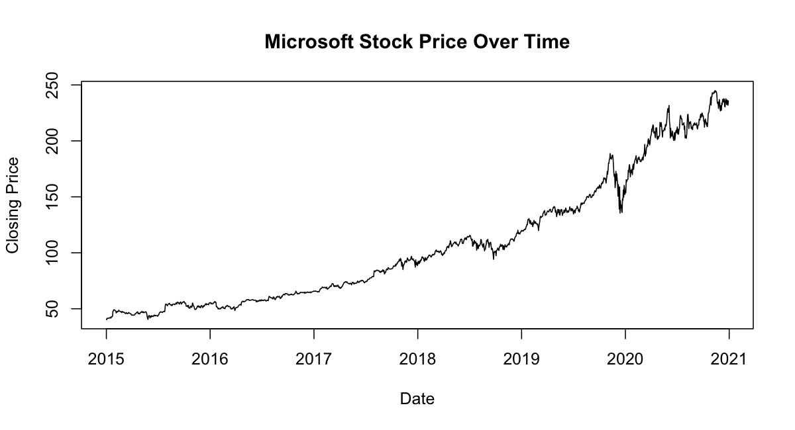
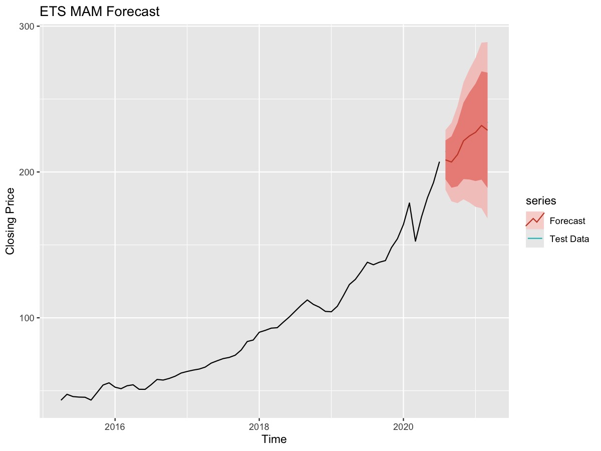

# Microsoft Stock Time Series Analysis

Portfolio project for classical time series forecasting of Microsoft stock closing prices. The project takes raw daily market data, builds reproducible R scripts, explores trend and stationarity, compares ARIMA, Holt-Winters, and ETS models, and connects the full workflow to a report notebook.



## Project Goal

The goal is to forecast Microsoft closing prices and evaluate which classical time series model performs best on a held-out test period.

This project demonstrates:

- Data cleaning and reproducible pipeline design in R
- Time series decomposition, stationarity checks, and transformations
- ARIMA model selection and residual diagnostics
- Holt-Winters and ETS forecasting on monthly aggregated data
- Model comparison using RMSE, MAE, MAPE and Theil's U


## Dataset

The dataset is stored locally at `data/raw/microsoft_stock.csv` and contains Microsoft stock prices from **2015-04-01** to **2021-03-31**.

Processed series:

- Daily close price time series: **1,511 observations**
- Monthly average close price time series: **72 observations**
- Target variable: `Close`

## Repository Structure

```text
.
├── R/                    # Modular R scripts for the complete analysis
├── data/
│   ├── raw/              # Original CSV data
│   ├── interim/          # Intermediate RDS files
│   └── processed/        # Cleaned and transformed RDS files
├── notebooks/
│   └── report.ipynb      # Full reproducible report
├── outputs/              # Generated plots and model diagnostics
└── README.md             # Portfolio project overview
```

## Methodology

The analysis is split into small scripts under `R/`:

1. Load raw CSV data and save it as an RDS file.
2. Clean and sort the date column.
3. Build daily and monthly time series objects.
4. Explore the original series, trend, STL decomposition, rolling volatility, ACF, and PACF.
5. Test stationarity using ADF and KPSS tests.
6. Apply differencing, seasonal differencing, logarithmic transformation, and Box-Cox transformation.
7. Fit and evaluate ARIMA and Auto ARIMA models.
8. Fit Holt-Winters additive, damped, multiplicative, and multiplicative damped models.
9. Fit manual and automatic ETS model variants.
10. Compare forecast accuracy on the test period.

## Model Results

The best-performing model in this project is **ETS MAM** on the monthly time series.

| Model | Test RMSE | Test MAE | Test MAPE | Theil's U |
|---|---:|---:|---:|---:|
| ETS MAM | 5.69 | 5.18 | 2.33% | 0.71 |
| ETS MAM Damped | 6.22 | 5.36 | 2.41% | 0.79 |
| Holt-Winters Multiplicative Damped | 7.89 | 6.85 | 3.10% | 1.03 |
| ETS MAA | 7.29 | 6.85 | 3.12% | 0.99 |
| Auto ARIMA(5,1,8) | 14.26 | 10.92 | 4.77% | 3.44 |
| ARIMA(10,1,6) | 14.55 | 11.11 | 4.84% | 3.50 |

The ETS MAM model produced the lowest test MAPE and RMSE among the compared models, making it the strongest candidate for this dataset and evaluation setup.



## Key Findings

- The original Microsoft close price series is non-stationary, with a strong upward trend.
- First differencing improves stationarity based on ADF and KPSS tests.
- ARIMA models capture short-term daily dynamics but performed worse on the test set than the monthly ETS models.
- Monthly ETS models handled trend and seasonal structure more effectively.
- The best test performance came from **ETS MAM**, with **2.33% MAPE**.

## Report Notebook

The full report is available in:

```text
notebooks/report.ipynb
```

The notebook is connected directly to the scripts in `R/`. Re-running all notebook cells rebuilds the processed datasets, regenerates plots in `outputs/`, prints test results and model accuracy metrics, and displays the final forecasts.

## Tools

- Language: R
- Notebook: Jupyter Notebook with R kernel
- Main libraries: `forecast`, `tseries`, `zoo`, `dplyr`, `ggplot2`

## Conclusion

This project shows a complete classical forecasting workflow for financial time series data. The final portfolio-ready pipeline is modular, reproducible, and documented through a report notebook. Among all tested models, **ETS MAM** achieved the best forecast accuracy on the held-out test period.
